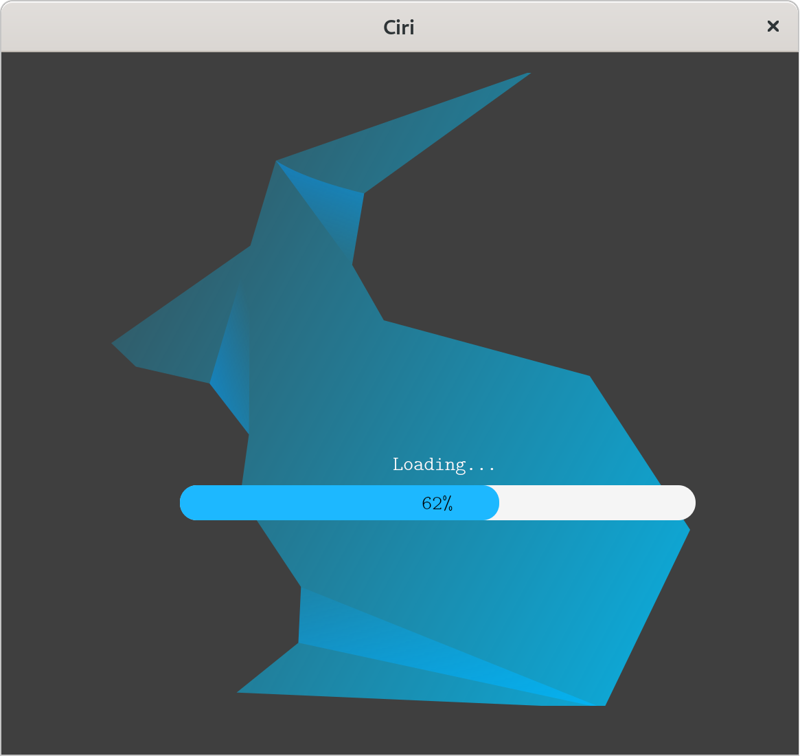
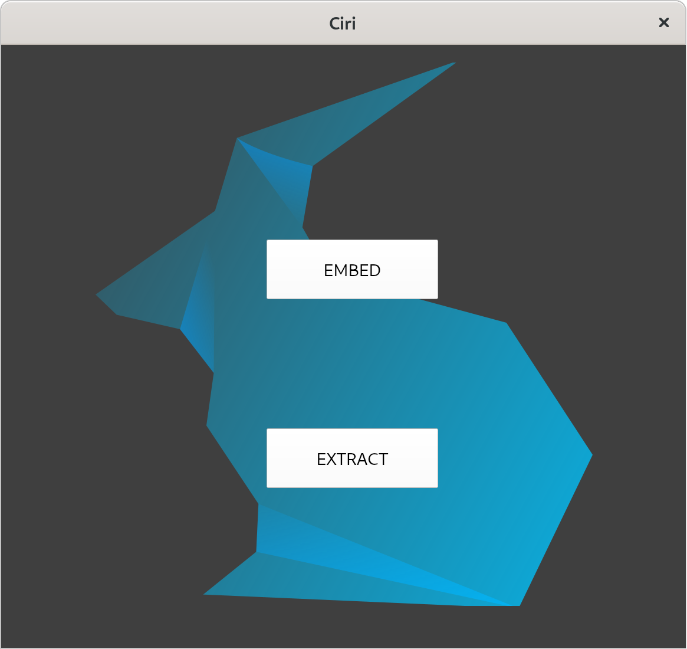
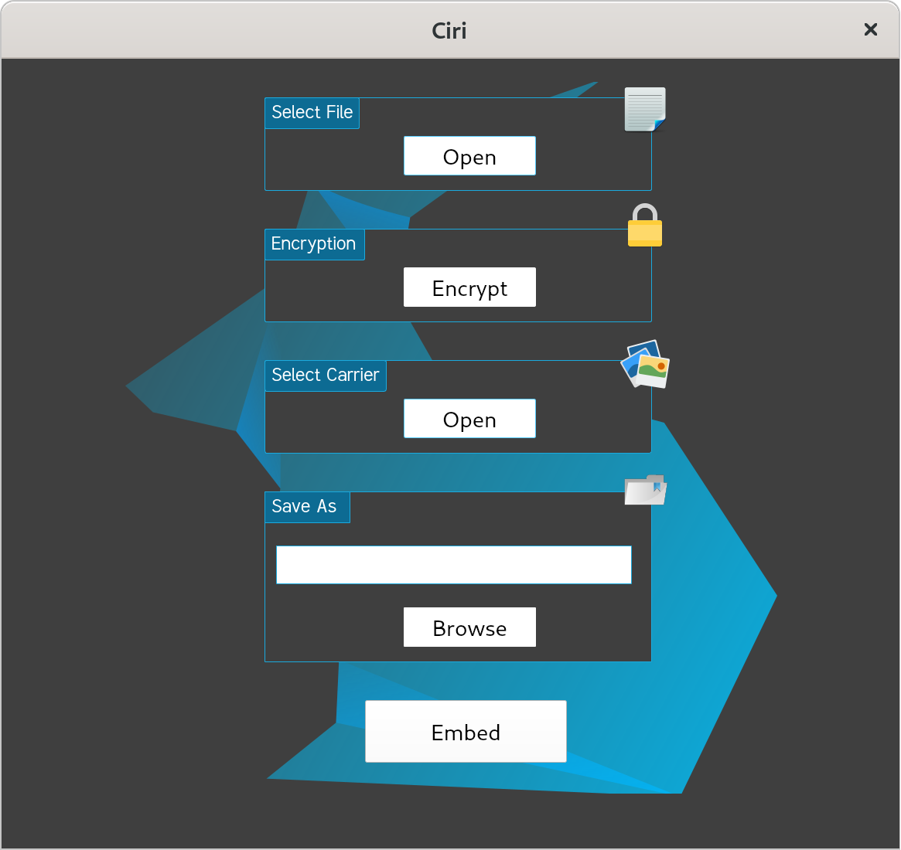
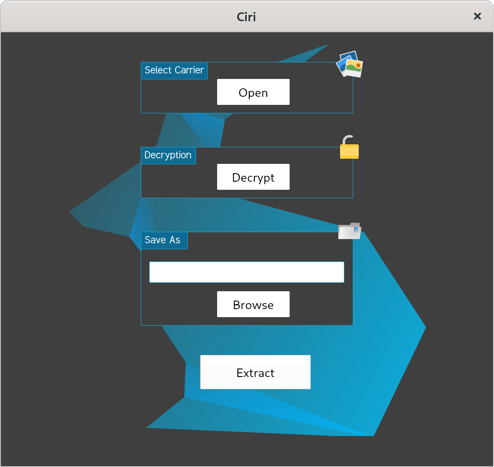
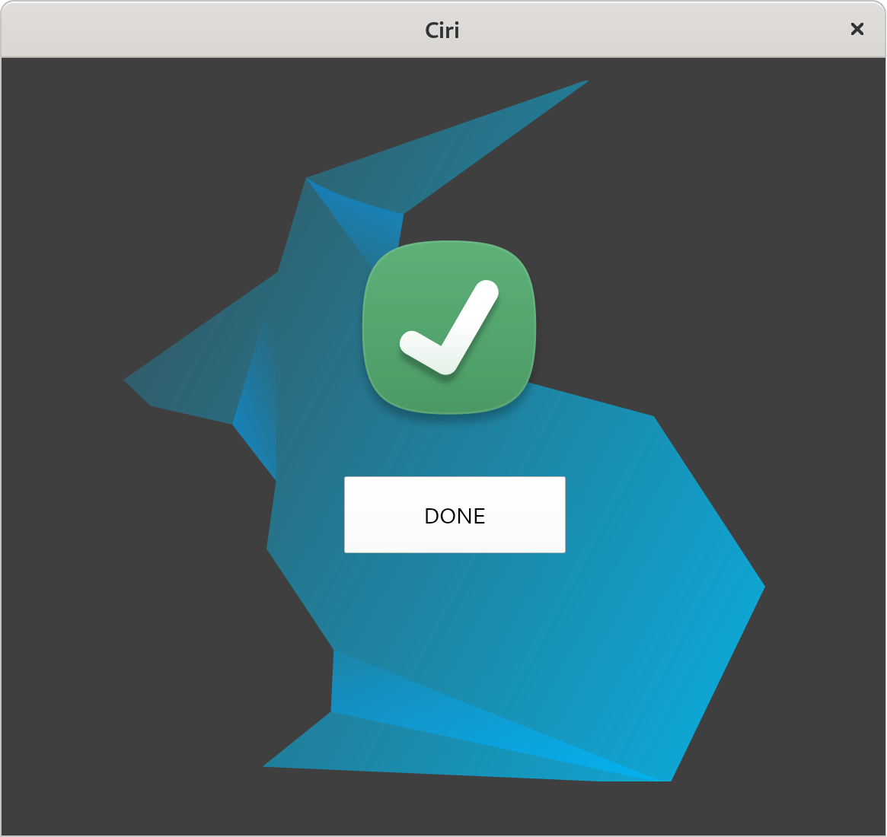

# Ciri


Ciri is a steganography tool which uses AES-256 in GCM mode to encrypt the given input (txt file) and uses LSB (Least Significant Bit) to hide the data inside an image.

## Usage

To run this browser on your machine, launch a terminal and run this command:

```
python ciri.py
```

### Hiding Data
This tool is very straightforward and everything is clear. If you want to hide a message inside an image click on "Embed". Choose a text file and enter a strong password to encrypt it. Select a carrier which holds your message and then choose a location to save your file. When you are ready click on "Embed". If the operation was successful, you'll see a check mark. Do not try to store long texts inside the image.

  
### Extracting Data
If you have a carrier and you want to extract the hidden message, you must have the password to decrypt the text file. Open carrier and enter password and choose a directory where you want to save your message. When you're ready click on "Extract" button. If the operation was successful, you'll see a check mark.

## Screenshots












## Requirements

To install requirements for this project, open up a terminal window and run this command:

```
pip install -r requirements.txt	
```

## Credits

The icons used in this project were created by [Papirus Development Team](https://github.com/PapirusDevelopmentTeam), [zerode](http://www.zerode.com/), [AlienValley](http://www.alienvalley.com/) and [Icojam](http://www.icojam.com).

## Disclaimer

Please do not use this tool for any nefarious purposes. I am not responsible for any kind of harm or damage. Use this tool at your own risk.
